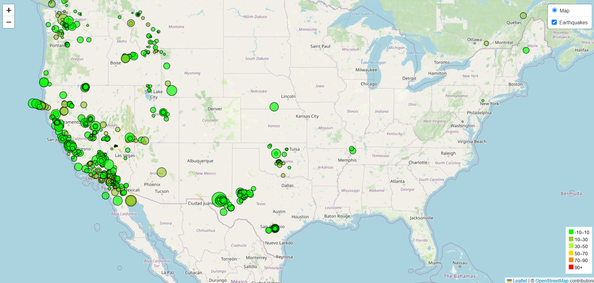

# Leaflet_Challenge

# Summary of the Earthquake Visualization Project
## Background
The United States Geological Survey (USGS) plays a crucial role in providing scientific data related to natural hazards, ecosystem health, environmental conditions, and the effects of climate and land-use changes. While the USGS collects vast amounts of global data daily, it lacks effective visualization tools to present this information meaningfully. To address this gap, the goal of this project was to develop an interactive visualization of earthquake data to help educate the public and government organizations about seismic activities, potentially aiding in securing additional funding for USGS initiatives.

## Project Objective
The primary objective was to create a dynamic, user-friendly map that visualizes real-time earthquake data provided by the USGS through their GeoJSON feed. This visualization aims to enhance data comprehension and provide an intuitive platform for exploring earthquake patterns.

## Implementation Steps
*1.Data Acquisition:*
Accessed the USGS GeoJSON feed, specifically the dataset displaying all earthquakes from the past seven days.
Retrieved the JSON data via the feed's URL for integration into the visualization.

*2.Visualization Tool:*
Used Leaflet, a leading open-source JavaScript library, to create interactive maps.
Integrated the earthquake data by plotting each event based on its geographical coordinates (longitude and latitude).

*3.Data Visualization Techniques:*
Marker Size by Magnitude: Larger markers were used for earthquakes with higher magnitudes, providing a visual cue for the strength of the seismic event.
Marker Color by Depth: Applied a color gradient to the markers based on the depth of the earthquake. Deeper quakes were represented with darker colors, enhancing the map’s depth perception.
Popups for Detail: Enabled interactive popups displaying essential earthquake information (e.g., magnitude, location, and depth) when a marker was clicked.

*4.Legend Creation:*
Added a map legend to explain the color gradient used for earthquake depth, offering users context for interpreting the visualization accurately.

